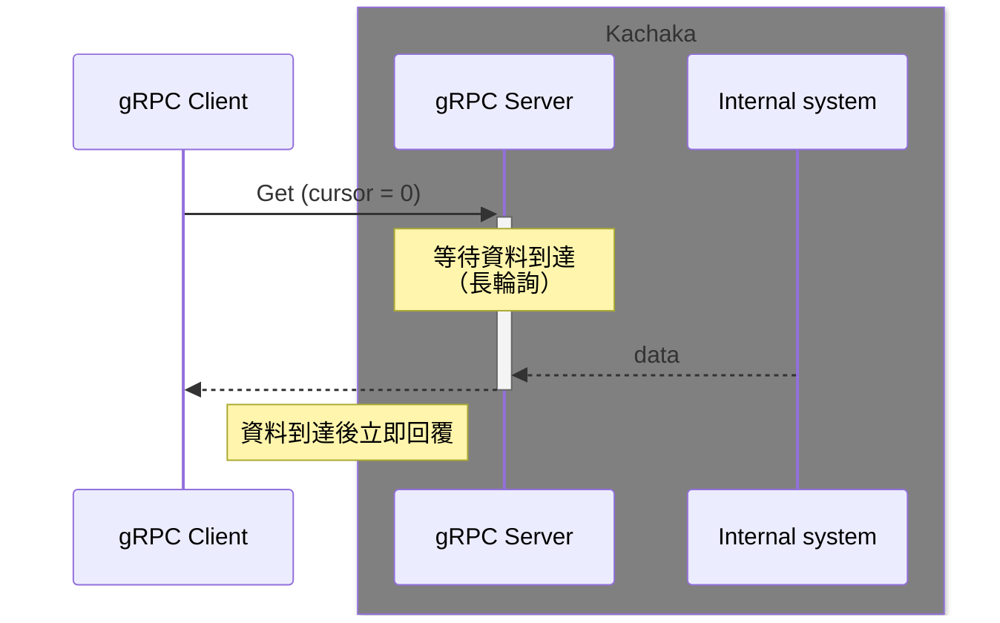
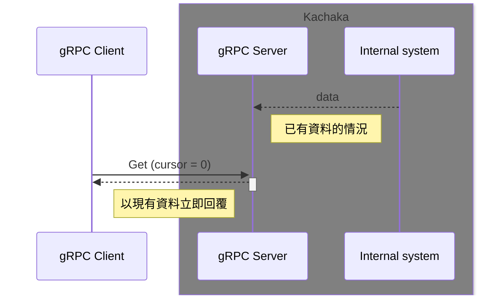
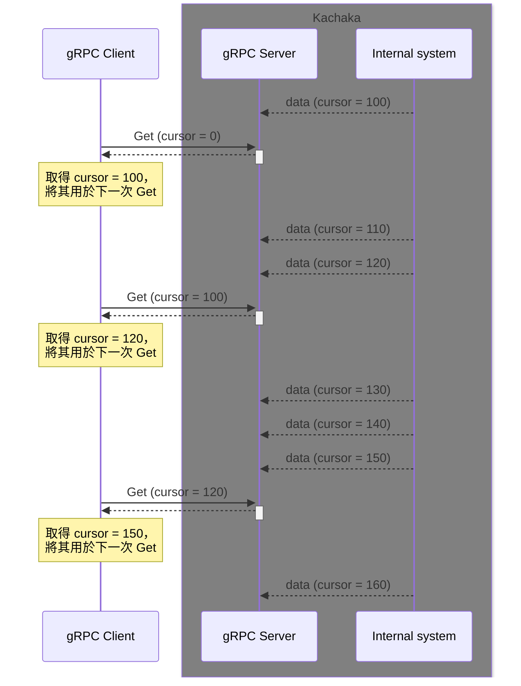
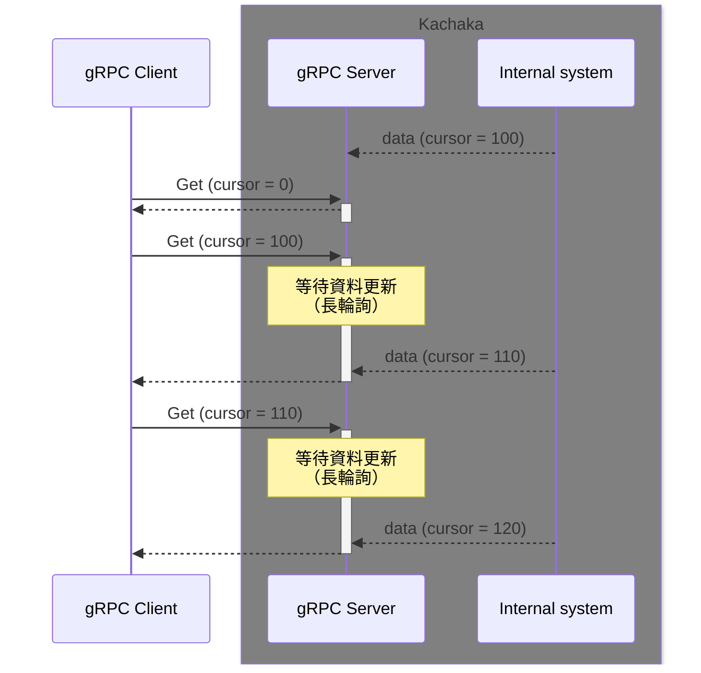

# 使用 Python 和 ROS2 以外的語言操作 Kachaka API

本儲存庫僅支援 Python 和 ROS 2，但也可以從其他語言和環境使用 Kachaka API。
Kachaka API 是以 gRPC 通訊介面的形式提供的，因此只要能準備符合通訊規格的客戶端，就可以從任何環境使用。

這裡以 Python 為例，說明如何自行開發 gRPC 客戶端。
其他語言請參考 [gRPC 官方文件](https://grpc.io/docs/)，以類似的方法開發客戶端。也歡迎您的貢獻。

## 目錄
- [什麼是 gRPC](#什麼是-grpc)
- [使用 Python 開發 gRPC 客戶端](#使用-python-開發-grpc-客戶端)
- [gRPC 範例程式碼一覽](#grpc-範例程式碼一覽)
  - [gRPC 範例程式碼的執行方法](#grpc-範例程式碼的執行方法)
- [使用 Cursor 進行長輪詢](#使用-cursor-進行長輪詢)

## 什麼是 gRPC

gRPC 是由 Google 開發的 RPC 框架。
RPC 是遠端程序呼叫（Remote Procedure Call）的縮寫，可以理解為透過網路呼叫 Kachaka 內部的函式（API）。

### 訊息定義和 rpc 定義
gRPC 使用 Protocol Buffers 進行資料序列化，rpc 的定義也是以擴展 Protocol Buffers 定義檔（proto）的形式進行。
Kachaka API 的訊息定義和 rpc 定義記述在 [kachaka-api.proto](../protos/kachaka-api.proto) 中。


## 使用 Python 開發 gRPC 客戶端

* 接下來，讓我們實際使用 gRPC 來操作 Kachaka API（以 Python 為例）。
  * Python 的 kachaka_api 套件就是將此功能封裝成套件的產物。

### 從 proto 檔案生成程式碼
* 在 gRPC 中，會從 proto 檔案自動生成目標語言的程式碼來使用。
  * 也就是說，它會將 proto 中定義的訊息型別和 rpc 定義轉換為您所使用的語言可用的形式。
* 執行以下命令下載範例程式碼。

```bash
cd ~
git clone https://github.com/pf-robotics/kachaka-api.git
```

* 執行以下命令後，會從 proto 檔案生成使用 gRPC 所需的程式碼。

```bash
mkdir -p ~/kachaka_grpc_client
cd ~/kachaka_grpc_client
python3 -m venv venv
source venv/bin/activate

pushd ~/kachaka-api/python/demos
pip install -r requirements.txt
popd

python -m grpc_tools.protoc -I ~/kachaka-api/protos --python_out=. --pyi_out=. --grpc_python_out=. ~/kachaka-api/protos/kachaka-api.proto
```

* 這樣就會生成 `~/kachaka_grpc_client/kachaka_pb2.py` 和 `~/kachaka_grpc_client/kachaka_pb2_grpc.py`。
  * 這些檔案是在 Python 中使用 Kachaka API 的訊息型別和 rpc 定義的程式碼。
  * 使用這些檔案來建立 Kachaka API 的客戶端。

```python
import grpc
import kachaka_api_pb2
import schedule
from kachaka_api_pb2_grpc import KachakaApiStub

# 指定 Kachaka 的 IP 位址，建立 gRPC 客戶端。
stub = KachakaApiStub(grpc.insecure_channel("192.168.0.20:26400"))


def main() -> None:
    # 讓 Kachaka 執行發話指令
    req = kachaka_api_pb2.StartCommandRequest(
        command=kachaka_api_pb2.Command(
            speak_command=kachaka_api_pb2.SpeakCommand(text="こんにちは、カチャカです")
        )
    )

    response = stub.StartCommand(req)
    if not response.result.success:
        print("Sending speak command failed: " + response.result.error_code)
        return
    print("Speak command sent")

if __name__ == "__main__":
    main()
```

## gRPC 範例程式碼一覽

此外，在 [python/demos/grpc_samples](../python/demos/grpc_samples) 中有直接使用 gRPC（不使用 kachaka_api 套件）的 Python 範例程式碼。

### gRPC 範例程式碼的執行方法

#### 取得目的地列表（GetLocations）的執行範例

* 原始碼：[python/demos/grpc_samples/get_locations.py](../python/demos/grpc_samples/get_locations.py)

##### 執行方法
* 在電腦上執行時，請執行以下命令。
    * `<Kachaka 的 IP 位址>` 部分請輸入在智慧型手機應用程式中確認的 IP 位址。

```bash
cd ~
source venv/bin/activate
cd ~/kachaka-api/python/demos/grpc_samples
python get_locations.py <Kachaka 的 IP 位址>:26400
```

* 從 Playground 內執行時，首先透過 ssh 登入 Playground。
    * 登入後，執行以下命令。
        * 從 Playground 內執行時，IP 位址請使用 100.94.1.1。

```bash
cd ~/kachaka-api/python/demos/grpc_samples
python3 get_locations.py 100.94.1.1:26400
```

##### 執行結果範例

會顯示在智慧型手機應用程式中已註冊的目的地。

```javascript
metadata {
  cursor: 1902856679949
}
locations {
  id: "L01"
  name: "ダイニング"
  pose {
    x: 1.33572
    y: 2.328592
  }
}
locations {
  id: "home"
  name: "充電ドック"
  pose {
    x: 0.136266
    y: -0.037587
    theta: 0.021679
  }
  type: LOCATION_TYPE_CHARGER
}
default_location_id: "L01"
```

## 使用 Cursor 進行長輪詢

資料取得 API 為了以下目的，引入了基於 cursor 的已讀管理和長輪詢（[Wikipedia](https://ja.wikipedia.org/wiki/Push%E6%8A%80%E8%A1%93#Long_polling)）。

* 客戶端不會重複接收已經收到的資料
* 客戶端尚未收到的資料會由伺服器重新傳送
* 當客戶端處理滯後時，舊資料會被適當丟棄，僅傳送最新資料
* 可在伺服器端生成資料的時機接收

伺服器傳送支援已讀管理的資料時，會在 metadata 的 cursor 中放入一個數值。客戶端在發送請求時，將上次伺服器回傳的 cursor 嵌入 metadata 的 cursor 中。伺服器僅在收到的 cursor 與最新的 cursor 不同時才傳送最新資料，如果相同則延遲回覆直到有新資料準備好。

在啟動初期等客戶端尚無資料的情況下，傳送特殊的 cursor（0）即可讓伺服器回傳當時的最新資料。

如果始終需要請求時的最新資料，只需每次以 cursor=0 發送請求即可。

### 不設定 cursor（設為 0）時的行為





### 資料提供頻率高，不需要取得全部而只需要最新資料的情況



### 資料極少更新的情況


